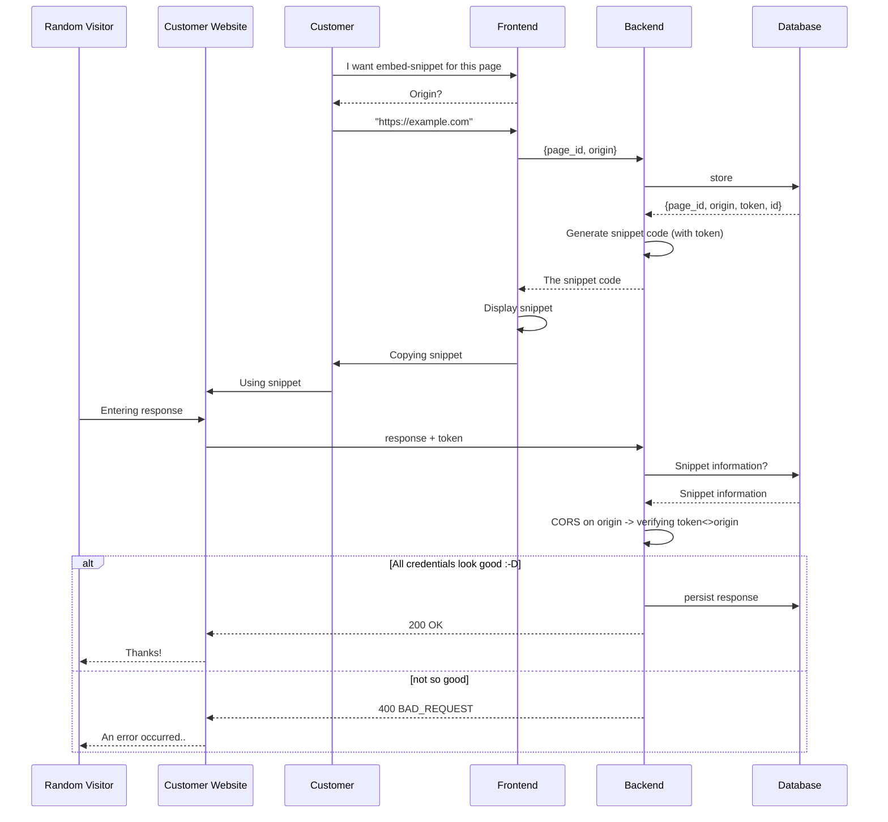

```mermaid 
sequenceDiagram 
participant Random Visitor
participant Customer Website
participant Customer
participant Frontend 
participant Backend 
participant Database

# Customer Initiating
Customer ->> Frontend: I want embed-snippet for this page
Frontend -->> Customer: Origin?
Customer ->> Frontend: "https://example.com"

# Generation of snippet / tokens 
Frontend ->> Backend: {page_id, origin}
Backend ->> Database: store 
Database -->> Backend: {page_id, origin, token, id}
Backend ->> Backend: Generate snippet code (with token)
Backend -->> Frontend: The snippet code
Frontend ->> Frontend: Display snippet 

# Customer Using Snippet 
Frontend ->> Customer: Copying snippet 
Customer ->> Customer Website: Using snippet 

## Random user using snippet 
Random Visitor ->> Customer Website: Entering response
Customer Website ->> Backend: response + token 
Backend ->>  Database: Snippet information?
Database -->> Backend: Snippet information 
Backend ->> Backend: CORS on origin -> verifying token<>origin
alt All credentials look good :-D
    Backend ->> Database: persist response
    Backend -->> Customer Website: 200 OK
    Customer Website -->> Random Visitor: Thanks!
else not so good
    Backend -->> Customer Website: 400 BAD_REQUEST
    Customer Website -->> Random Visitor: An error occurred..
end

```